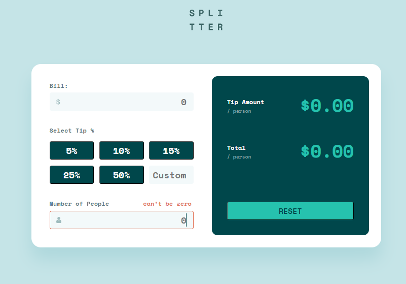

# Frontend Mentor - Tip calculator app solution

This is a solution to the [Tip calculator app challenge on Frontend Mentor](https://www.frontendmentor.io/challenges/tip-calculator-app-ugJNGbJUX). 

## Table of contents

- [Overview](#overview)
  - [The challenge](#the-challenge)
  - [Screenshot](#screenshot)
  - [Links](#links)
- [My process](#my-process)
  - [Built with](#built-with)
  - [What I learned](#what-i-learned)
  - [Continued development](#continued-development)
  - [Useful resources](#useful-resources)
- [Author](#author)
- [Acknowledgments](#acknowledgments)

## Overview

### The challenge

Users are able to:

- View the optimal layout for the app depending on their device's screen size
- See hover states for all interactive elements on the page
- Calculate the correct tip and total cost of the bill per person

### Screenshot

This is a screenshot of desktop design: ,
This is a screenshot of active desktop design: ,
This is a screenshot of "can't be zero" design: 
and this is a screenshot of mobile design: 

### Links

- Solution URL: [Add solution URL here](https://github.com/Aleqsa123/tip-calculator)
- Live Site URL: [Add live site URL here](https://aleqsa123.github.io/tip-calculator/)

## My process

### Built with

- Semantic HTML5 markup
- CSS custom properties
- Flexbox
- CSS Grid
- Mobile-first workflow
- [React](https://reactjs.org/) - JS library

### What I learned

I learned how to change element styles based on their values. These are not exellent solutions but they work.

### Continued development

I have to constinue working on the abovementiond challanges, and then take new ones.

## Author

- Github - [Aleqsa123](https://github.com/Aleqsa123)
- Linkedin - [Aleksi Merebashvili](https://www.linkedin.com/in/aleksi-merebashvili-36627426/)
- Facebook - [Aleksi Merebashvili](https://www.facebook.com/aleksi.merebashvili)
- Frontendmentor - [Aleqsa123] (https://www.frontendmentor.io/profile/Aleqsa123)
